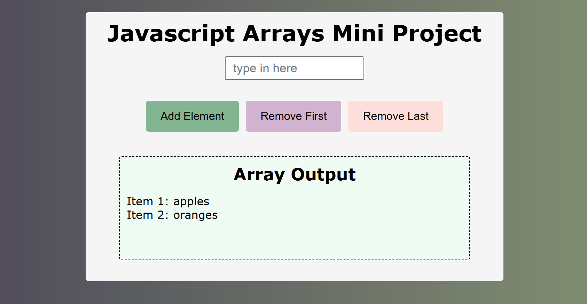

# Coding Challenge as part of an online coding diploma I'm doing

## Content

This one of a series of coding challenges I've completed while doing a Coding Diploma course with [Itonlinelearning](https://www.itonlinelearning.com/).

## Activity 6.1: Manipulating Arrays

## Objective

Create a mini project to practice JavaScript array methods, focusing on creating, indexing, and using methods like push, pop, shift, unshift, splice, and forEach.
